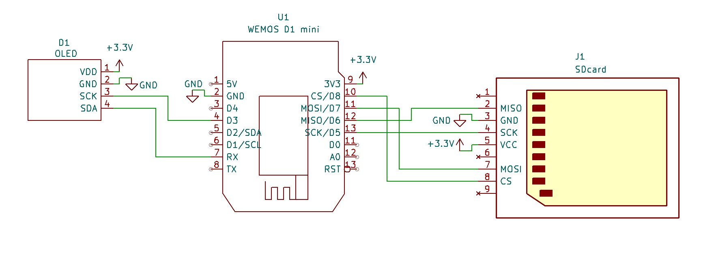

# 🖼️ gif_to_oled

Смотреть на ютубе.

[](https://www.youtube.com/watch?v=vkegFfLHL4U)

**gif_to_oled** — набор Python-скриптов и прошивки для конвертации анимированных GIF-файлов в 1-битные `.raw` файлы, пригодные для воспроизведения на OLED-дисплее через микроконтроллер (ESP8266 / ESP32).  
Проект включает инструменты для подготовки графики, загрузки файлов на MicroSD и схему подключения.

---

## 📂 Структура репозитория

```
gif_to_oled/
├── gif_to_1bit_raw.py
├── gif_to_1bit_raw1.py
├── gif_to_1bit_raw2.py
├── gif_to_1bit_raw3.py
├── gif_to_1bit_raw4.py
├── gif_to_1bit_raw5.py     ← разные варианты обработки кадров
│
├── sketch_nov7e/           ← скетч для ESP (Arduino)
│
├── PIL.zip                 ← архив с библиотекой Pillow (для офлайн запуска)
├── schematic.jpg           ← схема подключения OLED-дисплея и SD-карты
├── photo.png               ← фото ESP8266 с OLED экраном
|
├── cat.gif
├── gears.gif
├── yinyan.gif
│
├── bad_apple_480_360_fit.raw
├── bad_apple_480_360_stretch.raw
├── cat_threshold_200_fit_invert.raw
├── cat_threshold_200_stretch_invert.raw
├── gears_fit.raw
├── gears_fit_invert_th_200_5.raw
├── gears_stretch.raw
├── yinyan_fit.raw
├── yinyan_stretch.raw
│
└── (ffmpeg.exe — требуется отдельно)
```

---

## ⚙️ Зависимости

Для работы скриптов требуется Python 3 и несколько модулей:

```bash
pip install pillow numpy
```

или (если без интернета) распакуйте `PIL.zip` в каталог с проектом.

Также нужен `ffmpeg.exe` — его можно скачать отдельно:  
👉 [https://ffmpeg.org/download.html](https://ffmpeg.org/download.html)

Поместите `ffmpeg.exe` в ту же папку, где находятся `.py`-файлы.

---

## 🧩 Как использовать

1. Скопируйте нужный GIF в каталог проекта.  
2. Запустите один из скриптов, например:

   ```bash
   python gif_to_1bit_raw.py --input bad_apple_480_360.gif --output bad_apple_480_360_fit.raw --mode fit
   python gif_to_1bit_raw5.py --input gears.gif --output gears_fit_invert_th_200_5.raw --mode fit --invert --threshold 200
   ```

3. Скрипт создаст `.raw`-файл (монохромный, 1-бит на пиксель), который можно поместить на MicroSD для воспроизведения на OLED.

4. Загружайте файлы `.raw` на SD-карту и используйте со скетчем `sketch_nov7e`.

---

## 💾 Файлы для MicroSD

Готовые примеры уже включены:

```
bad_apple_480_360_fit.raw
bad_apple_480_360_stretch.raw
cat_threshold_200_fit_invert.raw
cat_threshold_200_stretch_invert.raw
gears_fit.raw
gears_fit_invert_th_200_5.raw
gears_stretch.raw
yinyan_fit.raw
yinyan_stretch.raw
```

Поместите их на SD-карту и используйте со скетчем `sketch_nov7e`.

---

## 🎞️ Примеры GIF-файлов

- `cat.gif`
- `gears.gif`
- `yinyan.gif`
- `bad_apple_480_360.gif` (слишком большой для GitHub, можно скачать отсюда):

👉 [Загрузить bad_apple_480_360.gif](https://drive.google.com/file/d/1A3WagKCYoFt4OeNjLDM2bYz-nFs8Y3qf/view?usp=sharing) 
*(замени ссылку на свой файлообменник: Google Drive, Mega, Dropbox и т.п.)*

---

## 🔌 Схема подключения



OLED-дисплей и MicroSD-карта подключаются к ESP по IIC и SPI, соответсвенно.  
Подробности — на схеме `schematic.jpg`.

---

## 💡 Замечания

- Разные скрипты (`gif_to_1bit_raw*.py`) используют немного разные методы конвертации и пороговой обработки.  
  Можно экспериментировать, выбирая оптимальный вариант для конкретного дисплея и контрастности.  
- Если дисплей инвертирует изображение, попробуйте запустить с параметром `--invert`.  
- После отработки py-скрипта появится файл с таймингами кадров анимации.
- В скетче есть код для профайлера, но закомментирован. Был нужен для подгонки скорости "Bad apple!!"
---

## 🧠 Авторство

🧑‍💻 **99 % ChatGPT**,  
🪄 **1 % — человеческие правки, отладка и терпение.**

---

## 📜 Лицензия

MIT License — свободное использование с указанием автора.

---
